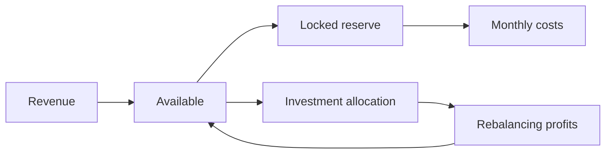

# Reserve plus rebalancer

The smallest treasury that's actually complete. Start here.

Two parts: money you can't touch, and money that's working. Almost every larger system in this catalog is a variation on this shape, so it's worth understanding before the others.

## The allocation

A 10,000 USDC treasury with roughly 1,200 a month in costs:

| Purpose | Amount | State |
|---|---|---|
| Operating reserve — 6 months | 7,200 | **Locked** |
| Investment allocation | 2,500 | [Rebalancing](../strategies/portfolio/rebalancing.md), 60/40 ALGO/USDC |
| Running costs | ~300 in ALGO | Transaction fees and minimum balance |

The reserve is locked, not merely earmarked. No strategy can spend it, automation can't reach it, and it won't leave in a withdrawal until you unlock it. Should the rebalancing strategy behave in a way nobody predicted, the worst case is bounded at 2,500.

## How money moves

Revenue arrives as available capital. You top up the reserve when costs rise, and fund the allocation with what's genuinely spare. Investment gains return to available, where you decide what they become.

## Running it

**Monthly:** check that the reserve still covers six months at current burn. Costs grow.

**Quarterly:** decide whether the investment allocation should change size. Rising revenue means more is genuinely spare; falling revenue means less.

**When rebalancing fires:** nothing to do. That's the point of it.

## Growing into more

Lend the reserve so it earns while it waits — see [idle capital](../strategies/lending/idle-capital.md), and accept that withdrawals take time.

Add a [grid](../strategies/trading/basic/grid.md) as a third, separately funded allocation once you're comfortable. That becomes [trading plus lending](trading-plus-lending.md).

Pay contributors from the reserve on schedule with [recurring payments](../use-cases/commerce/recurring-payments.md), without unlocking the whole thing.

## What to watch for

**Six months of the wrong number isn't six months.** Size the reserve from real costs. This is the single most common way this system fails.

**Keep ALGO for running costs.** Fees and minimum balance come out of ALGO, not your USDC. A strategy that stops because running costs ran dry is an avoidable annoyance. See [costs](../../docs/overview/costs.md).

**Rebalancing underperforms a rising market.** It trims winners by design. If that will bother you, size the allocation accordingly.

**Related**

- [Reserve management](../strategies/portfolio/reserve-management.md) · [rebalancing](../strategies/portfolio/rebalancing.md)
- [Trading plus lending](trading-plus-lending.md) · [DAO operating reserve](../use-cases/treasury/dao-treasury.md)
