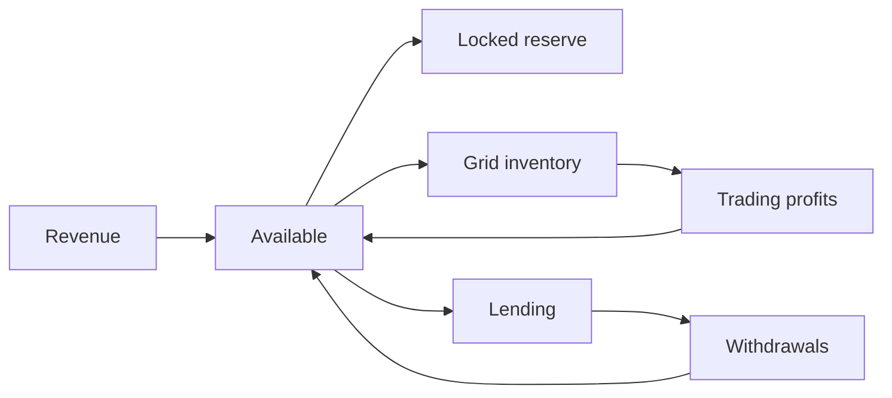

# Trading plus lending treasury

Active trading, idle capital earning, and an operating reserve neither can reach.

The step up from [reserve plus rebalancer](reserve-plus-rebalancer.md): the same protected core, with capital doing two different jobs alongside it.

## The allocation

A 50,000 USDC treasury with roughly 4,000 a month in costs:

| Purpose | Amount | State |
|---|---|---|
| Operating reserve — 6 months | 24,000 | **Locked** |
| Trading inventory | 10,000 | [Grid](../strategies/trading/basic/grid.md) on ALGO/USDC |
| Lending | 14,000 | [Idle capital](../strategies/lending/idle-capital.md) |
| Buffer | 2,000 | Available |
| Running costs | ~800 in ALGO | Fees and minimum balance |

The buffer matters more than it looks. Without it, every small need triggers a lending withdrawal, and those take time.

## How money moves

Three destinations, one source, and everything returns to available before being redeployed. The grid never draws on lending; lending never backstops the grid.

## Running it

**The grid runs on its own 10,000.** If it exhausts its buy side in a fall, it waits. Adding to it is a deliberate decision: withdraw from lending, confirm receipt, then fund. Days, not seconds.

**Lending is sized for patience.** 14,000 is capital you're confident you won't need quickly. If that's not true, it belongs in the buffer.

**Profits have a destination.** Point grid profits at lending and trading gains compound; point them at the reserve and it grows without new deposits. See [profit recycling](../strategies/portfolio/profit-recycling.md).

## What to watch for

**Lending is not a credit line for the grid.** The moment you most want capital back is the moment withdrawals are slowest. Plan as though the lending portion is unavailable for a week.

**Both suffer together in a crisis.** A crash hurts grid inventory and stresses lending markets at the same time. These are separate strategies, not uncorrelated ones.

**Three allocations, three sets of costs.** Each needs to be large enough to justify its fees.

**Tempting to raid the reserve.** The lock is what stops a bad month becoming a fatal one. Unlocking it during a drawdown defeats the entire design.

**Related**

- [Reserve plus rebalancer](reserve-plus-rebalancer.md) · [market-making treasury](market-maker.md)
- [Lending plus trading](../strategies/lending/lending-plus-trading.md)
- [Protocol treasury](../use-cases/treasury/protocol-treasury.md)
