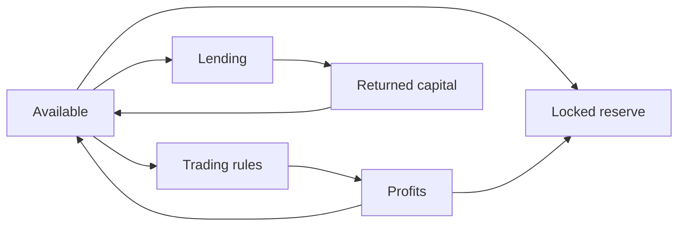

# Running several strategies together

One rule is useful. The reason to run a treasury on a passport is that several rules can run at once without interfering with each other.

## Give every part of the money a job

A plan is just a list of amounts with purposes attached. From a 10,000 USDC treasury:

| Amount | Job | State |
|---|---|---|
| 4,000 | Six months of payroll | Locked |
| 3,000 | Grid inventory on ALGO/USDC | Committed to the grid |
| 2,000 | Weekly ALGO purchases | Committed to the schedule |
| 1,000 | Unassigned | Available |

That accounts for the whole balance once. Locked, committed and available add up to the total — they don't stack on top of it. Releasing 500 from the grid moves it to available; it doesn't create new money.

The grid cannot spend the payroll. The purchase schedule cannot spend the grid's inventory. This holds even if a rule's own settings would happily allow a larger trade — the passport checks what the capital belongs to before it checks anything else.

## What you can build with

| Block | Use it for |
|---|---|
| **Grid levels** | Trading a range repeatedly from a capped inventory |
| **Scheduled buying** | Building a position over time, with a price floor |
| **Orders** | Selling into strength, or standing offers with an expiry |
| **Allocation rules** | Holding a target mix as prices move |
| **Lending** | Earning on idle cash, or borrowing against holdings |
| **Recurring payments** | Payroll, royalties, vesting, grants |
| **Locks** | Putting capital out of reach of everything |
| **Profit routing** | Deciding where gains go when a trade closes |

## Combinations that work

| Combination | Why they fit |
|---|---|
| Grid + scheduled buying | The grid works the range; the schedule keeps accumulating regardless of range |
| Grid + rebalancing | The grid trades; profits in the matching asset top up the allocation |
| Scheduled buying + take-profit | Build a position over months, sell parts of it into strength |
| Lending + trading | Idle cash earns; a separate slice stays liquid and active |
| Reserve + recurring payments | Locked runway, with an authorized slice paying out on schedule |
| Bot + any strategy | Software reads the market and retunes; the passport enforces your limits |

Strategies don't call each other. Profit routing is the one built-in connection between them; everything else moves because you moved it.

## Where profits go

When a trade closes, a share of the gain can go somewhere automatically. You choose a percentage or a fixed amount, and one destination:

| Destination | Good for |
|---|---|
| **Your wallet** | Taking gains off the table |
| **Another strategy** | Compounding — the grid's profits grow the allocation, or a second strategy's inventory |
| **Running costs** | Keeping automation funded from what the strategy earns |

Sending profit to another strategy adds to its funding; it doesn't trigger it. The destination strategy runs when its own conditions are met, now with more to work with.

Routing to another strategy requires a matching asset — profits in USDC can top up a strategy that holds USDC. Nothing is converted on your behalf.

## Five decisions per plan

1. Give every allocation a purpose, an asset and a ceiling.
2. Keep spending money liquid and separate from anything slow to unwind.
3. Decide what each rule waits for before it acts.
4. Decide where its profits go.
5. Check real balances before you change funding — not projected ones.

See [complete systems](../../catalog/systems/README.md) and the [treasury allocation example](../../examples/treasury-allocation.md).
